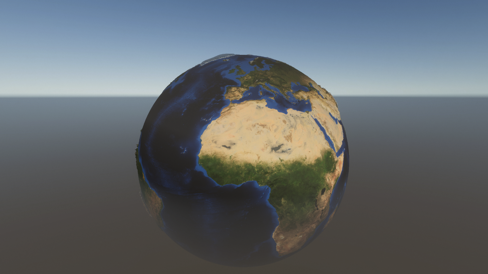

Many thanks to Sebastian Lague for inspiring this project. I leaned heavily on his code for this.

The idea for this project is to create a planetary model from a heightmap and texture (in this case Earth and respective NASA data).

This project is based on Sebastian Lague's Procedural Planets tutorials and his Geogrpahical Adventures game. 
I followed his Procedural Planets tutorials, however there wasn't a tutorial for making the Earth from a heightmap as he did in Geographical Adventures. I adapted the Procedural Planets code, and also delved into his Geographical Adventures project and source code to try to figure out how it worked.
